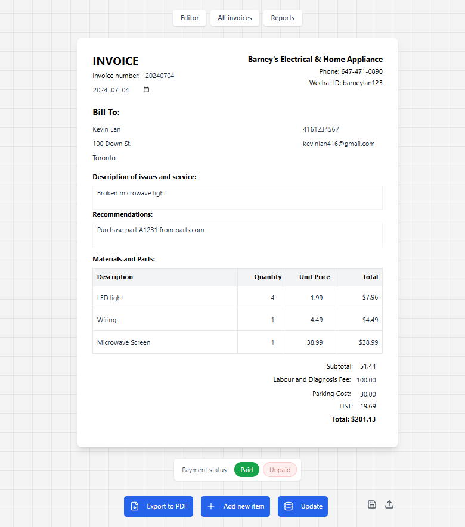
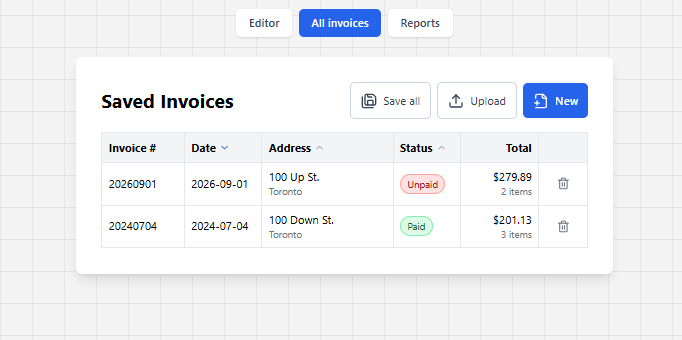
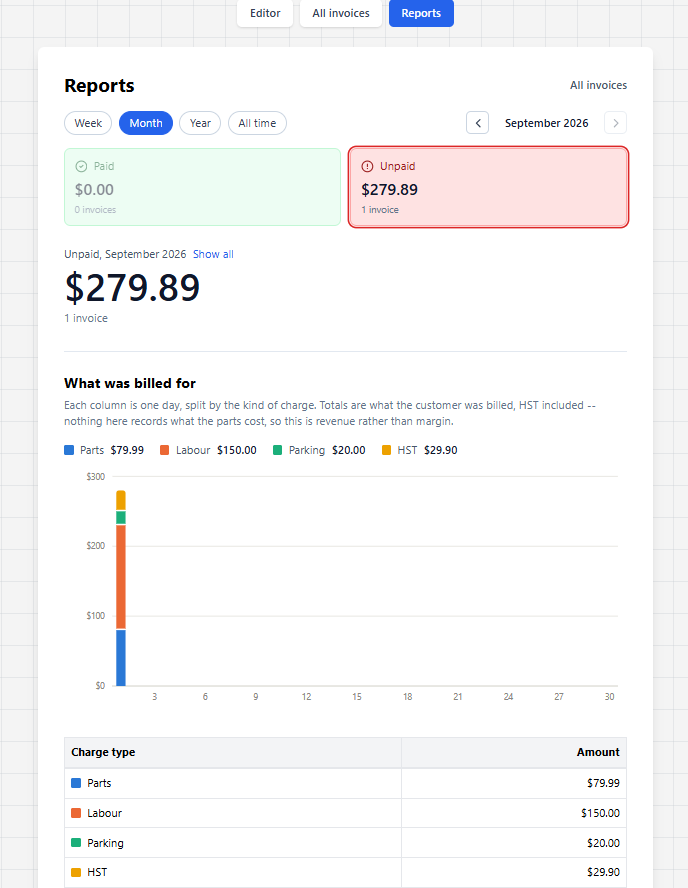

# Invoice generation tool
Micro-saas built for an HVAC business that downloads a react component as a pdf form. It has since grown into a small invoice book: every invoice can be saved, re-opened, tracked as paid or unpaid, and totalled up in reports. Everything is stored in the browser's own database, so there is no account, no server and no monthly bill. Check out the [live site](https://invoice-creator-hvac.vercel.app/).

## What it does
- **Editor** — fill in the customer, line items and fees (labour, parking); HST and the total update as you type, and the finished form exports to PDF.
- **Saved invoices** — invoices are saved locally and listed newest first, sortable by date, address, status or total. Click one to re-open it in the editor.
- **Payment status** — mark an invoice paid or unpaid. Writing one for a customer who already has unpaid invoices on file raises a warning in the editor, which is stripped out of the exported PDF.
- **Reports** — what was billed over a week, month, year or all time, stacked by parts, labour, parking and tax, with arrows to step through the calendar.
- **Backups** — save a single invoice or all of them as JSON, and upload files back to restore. Invoices carry a unique id, so restoring the same backup twice updates invoices instead of duplicating them.
- **Storage warning** — the app asks the browser to keep its data. If the browser will not promise to, a banner says so and points at the JSON backups.

## Tools used:
- React, Vite, react-hook-form, React Router, Dexie (IndexedDB), html2canvas, jspdf, TailwindCSS, Vercel

## Screenshots
**Editor** — line items, fees, HST and the running total, with payment status and the PDF export below the form.

**Saved invoices** — every invoice on file, sortable by number, date, address, status or total.

**Reports** — paid against unpaid for the period, broken down by parts, labour, parking and tax.

